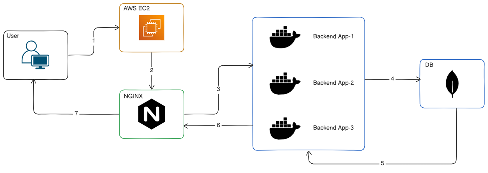
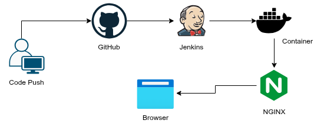
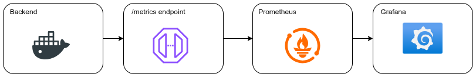

# Bookmark Saver API

This project demonstrates how to deploy and manage a scalable backend application using Dockerized infrastructure inside a single AWS EC2 instance.


The system includes:

- Reverse proxy setup
- Horizontal scaling
- CI/CD pipeline
- Monitoring & metrics
- Containerized deployment
- Production-style architecture

## Project Folder Structure

```bash
DEVOPS_TASK/
│
├── src/
│   ├── config/
│   │   └── db.js
│   │
│   ├── controllers/
│   ├── middleware/
│   ├── models/
│   ├── routes/
│   ├── utils/
│   │
│   ├── app.js
│   └── server.js
│
├── nginx/
│   ├── default.conf
│
│
├── monitoring/
│   ├── prometheus.yml
│   └── grafana/
│
├── jenkins/
│   └── Jenkinsfile
│
├── .dockerignore
├── .env
├── .gitignore
├── docker-compose.yml
├── Dockerfile
├── package.json
├── package-lock.json
├── README.md
└── LICENSE
```

## Technologies Used

| Category         | Technology |
| ---------------- | ---------- |
| Backend          | Node.js    |
| Database         | MongoDB    |
| Reverse Proxy    | Nginx      |
| Monitoring       | Prometheus |
| Dashboard        | Grafana    |
| CI/CD            | Jenkins    |
| Containerization | Docker     |
| Cloud Platform   | AWS EC2    |

## System Architecture

The system will completely run inside the AWS EC2 instance
| Component | Responsibility |
| ----------- | ------------------------------ |
| Nginx | Reverse proxy & load balancing |
| Backend API | Handles user requests |
| MongoDB | Stores application data |
| Jenkins | CI/CD automation |
| Prometheus | Collects metrics |
| Grafana | Visualizes monitoring data |

## Application Architecture



Bookmark Saver API Working Flow Steps:

1. First user will serach for the API through EC2 IP address
2. From EC2 user's request will go through the NGINX server
3. Nginx will choose the Backend app
4. Backend app communicate with the MongoDB
5. MongoDB sends back the response to the Backend app
6. Backend app take the response and share with the user

## Containerization Approach

The application is containerized using Docker. Each service runs in its own isolated container.

```bash
Backend → Docker Container
MongoDB → Docker Container
Nginx → Docker Container
Grafana → Docker Container
Prometheus → Docker Container
```

> Docker Compose is used to manage all containers together.

## Deployment Process


Deployment Process:

1. Push the code to the github
2. Jenkins server will automatically pull the code from the github
3. Container will be created by the automatic CI/CD pipeline
4. Then Nginx will fetch the update code
5. Nginx share the new code to the users

### CI/CD Pipeline

The CI/CD pipeline workflow:

- Source code cloning
- Dependency installation
- Docker image building
- Container deployment
- Automatic redeployment

## How Zero-Downtime Deployment Works

The application runs multiple backend containers simultaneously. Here, multiple backend application is running.

During deployment:

- New containers start
- Existing containers continue serving users
- Traffic shifts gradually
- Old containers stop after deployment

Benefits:

- Users still receive responses
- Downtime becomes minimal
- Application availability improves

## Monitoring Flow



### Monitoring Setup

Monitoring stack includes:

1. Prometheus
2. Grafana

Monitoring Workflow:

1. Backend server send the metrics using the `/metric` endpoint
2. All the information grab by `Prometheus`
3. Present the dashboard to see the information using the `Grafana`

## How the System Handles ~100 Requests/sec

This system uses horizontal scaling. Instead of running one backend container it actually runs multiple backend containers. Nginx distributes traffic across containers.

Here is an example of distribution of the request through Nginx

```bash
Request 1 → backend-1
Request 2 → backend-2
Request 3 → backend-3
Request 4 → backend-4
Request 5 → backend-2
```

This will improve the followings:

- Concurency
- Throughput
- Response time
- Availability

### Automatic Container Recovery

Docker restarts polices are enabled in this system. For that reason, if a container crashes docker automatically restarts it and Nginx continues routing traffic to healthy containers.

## AWS EC2 Deployment

EC2 Configutrations
| Configuration | Value |
| -------------- | ------------ |
| OS | Ubuntu 26.04 |
| Instance Type | t3.micro |
| Storage | 20GB |

### Required Security Groups Ports

| Port | Purpose    |
| ---- | ---------- |
| 22   | SSH        |
| 80   | HTTP       |
| 8080 | Jenkins    |
| 3000 | Grafana    |
| 9090 | Prometheus |

> Here, mention that we do not need to expose MongoDB port publicly.

## Access Services

| Service     | URL                    |
| ----------- | ---------------------- |
| Application | http://ip_address      |
| Jenkins     | http://ip_address:8080 |
| Grafana     | http://ip_address:3000 |
| Prometheus  | http://ip_address:9090 |

## Conclusion

This project demonstrates a real-world DevOps deployment pipeline using Dockerized infrastructure inside AWS EC2.
